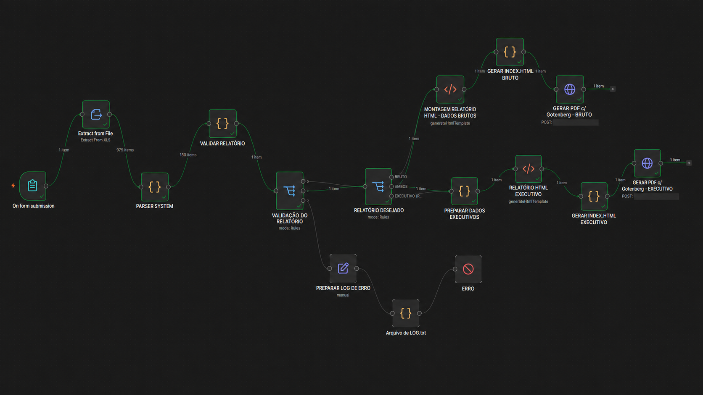

# Arquitetura da Automação

Este documento descreve a arquitetura do workflow responsável pelo processamento, validação e geração automática de relatórios de produção utilizando **n8n**, **JavaScript**, **HTML/CSS**, **Docker** e **Gotenberg**.

> **Privacidade:** esta documentação representa a versão pública e anonimizada do projeto. Endereços IP, nomes de empresa, produtos, documentos, volumes, credenciais e demais informações internas foram removidos ou substituídos.

---

## Visão Geral

O objetivo da automação é receber um relatório bruto exportado de um ERP, interpretar os registros de produção, validar os dados e gerar automaticamente relatórios em PDF.

A partir de um único arquivo de entrada, o workflow pode gerar:

- **Relatório Bruto**
- **Relatório Executivo**
- **Ambos os relatórios**
- **Log de erro**, quando alguma validação crítica falha

---

## Arquitetura do Workflow



---

## Fluxo de Processamento

```text
┌─────────────────────────┐
│   Upload do relatório   │
│        ERP / XLS        │
└────────────┬────────────┘
             │
             ▼
┌─────────────────────────┐
│   Extração do arquivo   │
│        XLS → JSON       │
└────────────┬────────────┘
             │
             ▼
┌─────────────────────────┐
│      Parser SYSTEM      │
│      JavaScript         │
└────────────┬────────────┘
             │
             ▼
┌─────────────────────────┐
│ Validação do Relatório  │
│ OK / ALERTA / ERRO      │
└───────┬─────────┬───────┘
        │         │
   OK/ALERTA     ERRO
        │         │
        ▼         ▼
┌─────────────┐   ┌──────────────────┐
│ Tipo de     │   │ Preparação do    │
│ Relatório   │   │ Log de Erro      │
└──────┬──────┘   └────────┬─────────┘
       │                   │
       │                   ▼
       │             ┌───────────────┐
       │             │ LOG de Erro   │
       │             │     .TXT      │
       │             └───────────────┘
       │
       ├─────────────────────────────┐
       │                             │
       ▼                             ▼
┌───────────────────┐       ┌─────────────────────┐
│ Relatório Bruto   │       │ Relatório Executivo│
│ HTML              │       │ Consolidação Dados │
└─────────┬─────────┘       └──────────┬──────────┘
          │                            │
          ▼                            ▼
┌───────────────────┐       ┌─────────────────────┐
│   index.html      │       │ HTML Executivo      │
└─────────┬─────────┘       └──────────┬──────────┘
          │                            │
          ▼                            ▼
┌───────────────────┐       ┌─────────────────────┐
│    Gotenberg      │       │     Gotenberg       │
│    HTML → PDF     │       │     HTML → PDF      │
└───────────────────┘       └─────────────────────┘
```

---

# Componentes da Arquitetura

## 1. Formulário de Entrada

O workflow é iniciado através de um formulário no n8n.

O usuário informa:

- mês de referência;
- ano;
- arquivo exportado pelo ERP;
- tipo de relatório desejado.

Tipos disponíveis:

```text
BRUTO
EXECUTIVO
AMBOS
```

O arquivo enviado é encaminhado para a etapa de extração.

---

## 2. Extração do XLS

O node **Extract from File** realiza a leitura do arquivo Excel e transforma as linhas da planilha em itens que podem ser manipulados pelo n8n.

```text
XLS
 ↓
JSON
```

Essa etapa mantém os dados ainda próximos ao formato original do ERP.

---

## 3. Parser

O **Parser SYSTEM** é responsável por transformar os registros brutos do ERP em uma estrutura padronizada.

Exemplo público e fictício:

```json
{
  "codigoProduto": "1001",
  "produto": "PRODUTO EXEMPLO",
  "documento": "5001",
  "dataEntrada": "2026-01-10",
  "quantidadeProduzida": 12000,
  "unidade": "UN",
  "valorUnitario": 1.25,
  "valorTotal": 15000,
  "materiaisUtilizados": []
}
```

O objetivo dessa etapa é desacoplar o restante do workflow do formato original do relatório.

---

## 4. Validação do Relatório

Após o parsing, o relatório passa por uma camada de validação.

São verificadas condições como:

- competência do relatório;
- ano informado;
- quantidade total;
- valores consolidados;
- intervalo de documentos;
- possíveis documentos ausentes;
- inconsistências entre dados informados e calculados.

O resultado pode assumir três estados:

```text
OK
ALERTA
ERRO
```

### OK

O processamento continua normalmente.

### ALERTA

O relatório pode continuar sendo gerado, mas alguma inconsistência não crítica foi identificada.

### ERRO

Uma inconsistência crítica impede a continuidade do processamento e direciona o fluxo para a geração de log.

---

## 5. Tratamento de Erros

Quando uma validação crítica falha, o workflow prepara automaticamente um arquivo de log.

Exemplo:

```text
STATUS: ERRO

COMPETÊNCIA INFORMADA:
01/2026

MOTIVO:
Competência informada diferente da encontrada no relatório.

PROCESSAMENTO INTERROMPIDO
```

O objetivo é permitir rastreabilidade do processamento sem depender apenas do histórico interno de execução do n8n.

---

# Geração dos Relatórios

Após a validação, um **Switch** decide qual tipo de documento deve ser produzido.

---

## 6. Relatório Bruto

O relatório bruto preserva maior nível de detalhamento operacional.

Ele apresenta:

- indicadores gerais;
- status das validações;
- documentos processados;
- ordens de produção;
- produtos;
- quantidades;
- valores;
- quantidade de materiais associados.

Fluxo:

```text
Dados validados
      ↓
Template HTML
      ↓
index.html
      ↓
Gotenberg
      ↓
PDF
```

---

## 7. Preparação dos Dados Executivos

Antes da geração do relatório executivo é realizada uma nova consolidação.

Os dados são agrupados por produto para calcular indicadores como:

```text
Produção Total
Quantidade de Ordens
Quantidade de Produtos
Média por Ordem
Produto com Maior Produção
Produto com Menor Produção
Participação Percentual por Produto
Ranking de Produção
```

Essa camada separa a lógica de análise da camada de apresentação.

---

## 8. Relatório Executivo

O relatório executivo possui foco gerencial.

Em vez de listar todas as ordens individualmente, ele apresenta uma visão consolidada da produção.

Elementos disponíveis:

- KPIs;
- ranking de produtos;
- maior produção;
- menor produção;
- distribuição percentual;
- gráfico de barras;
- gráfico de participação;
- alertas;
- resumo automático.

Fluxo:

```text
Ordens
  ↓
Consolidação
  ↓
Indicadores
  ↓
HTML Executivo
  ↓
index.html
  ↓
Gotenberg
  ↓
PDF
```

---

# Conversão HTML → PDF

A geração dos PDFs é realizada utilizando **Gotenberg**.

O Gotenberg utiliza Chromium para renderizar o HTML recebido e retornar o documento em PDF.

Na versão pública do projeto, o endpoint é representado como:

```text
http://gotenberg:3000
```

Nenhum endereço de rede utilizado no ambiente original está presente nesta documentação.

---

# Tecnologias

| Tecnologia | Função |
|---|---|
| **n8n** | Orquestração do workflow |
| **JavaScript** | Parsing, validação e consolidação |
| **HTML** | Estrutura dos relatórios |
| **CSS** | Layout e apresentação visual |
| **Gotenberg** | Conversão HTML para PDF |
| **Docker** | Execução dos serviços |
| **XLS / Excel** | Fonte dos dados |

---

# Separação de Responsabilidades

A arquitetura foi dividida em etapas independentes:

```text
EXTRAÇÃO
   ↓
PARSING
   ↓
VALIDAÇÃO
   ↓
DECISÃO
   ↓
ANÁLISE
   ↓
APRESENTAÇÃO
   ↓
GERAÇÃO DE PDF
```

Essa divisão facilita:

- manutenção;
- debugging;
- reutilização;
- alteração de templates;
- inclusão de novas validações;
- integração futura com outros sistemas.

---

# Segurança e Privacidade

O workflow utilizado no ambiente real contém informações que não devem fazer parte de um repositório público.

Por isso, esta versão utiliza dados anonimizados.

Foram removidos ou substituídos:

```text
Endereços IP internos
URLs privadas
Credenciais
Tokens
Dados de produção
Nomes reais de produtos
Números reais de documentos
Informações corporativas
Identidade visual interna
Arquivos originais do ERP
```

Os dados utilizados nos exemplos deste repositório são exclusivamente fictícios.

---

# Possíveis Evoluções

A arquitetura permite adicionar novas funcionalidades futuramente, como:

- armazenamento automático dos PDFs;
- envio dos relatórios por e-mail;
- integração com Google Drive ou S3;
- dashboards históricos;
- banco de dados para persistência;
- notificações de erro;
- comparação automática entre competências;
- execução agendada;
- geração de relatórios de outros módulos do ERP.

---

# Resultado

O fluxo transforma um processo originalmente baseado em um relatório bruto em uma pipeline automatizada:

```text
ERP
 ↓
Arquivo XLS
 ↓
n8n
 ↓
Parser
 ↓
Validação
 ↓
Consolidação
 ↓
Relatórios
 ↓
PDF
```

O resultado é um processo mais estruturado, repetível e com menor dependência de tratamento manual dos dados.

---

## Autor

**Victor Djalma**

Projeto desenvolvido como estudo e aplicação prática de:

`Automação` • `Integração de Dados` • `JavaScript` • `n8n` • `Docker` • `Gotenberg`
